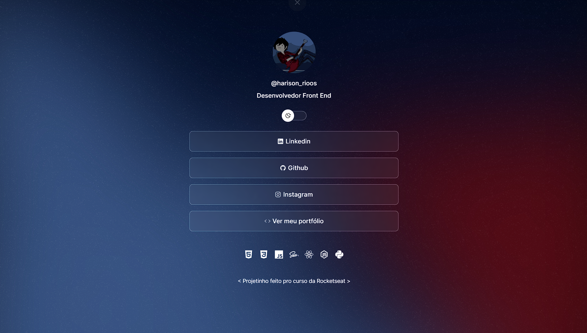

<h1 align="center"> DevLinks </h1>

Projetinho de DevLinks (Estilo aquelas bio do Insta) feito no cursinho da Rocketseat.  

 &nbsp;&nbsp;&nbsp;|&nbsp;&nbsp;&nbsp; <a href="#-tecnologias">Tecnologias</a>&nbsp;&nbsp;&nbsp;|&nbsp;&nbsp;&nbsp;
  <a href="#-Layout">Layout</a>&nbsp;&nbsp;&nbsp;|&nbsp;&nbsp;&nbsp;

 

  

## 🚀 Tecnologias

Esse projeto foi desenvolvido com as seguintes tecnologias:

- HTML e CSS
- JavaScript
- Git e Github
- Figma

## 🔖 Layout

Você pode visualizar o layout do projeto através [Desse Link](https://www.figma.com/community/file/1187422022288947321). É necessário ter conta no [Figma](https://figma.com) para acessá-lo.

 Rocketseat - Harison Rios
